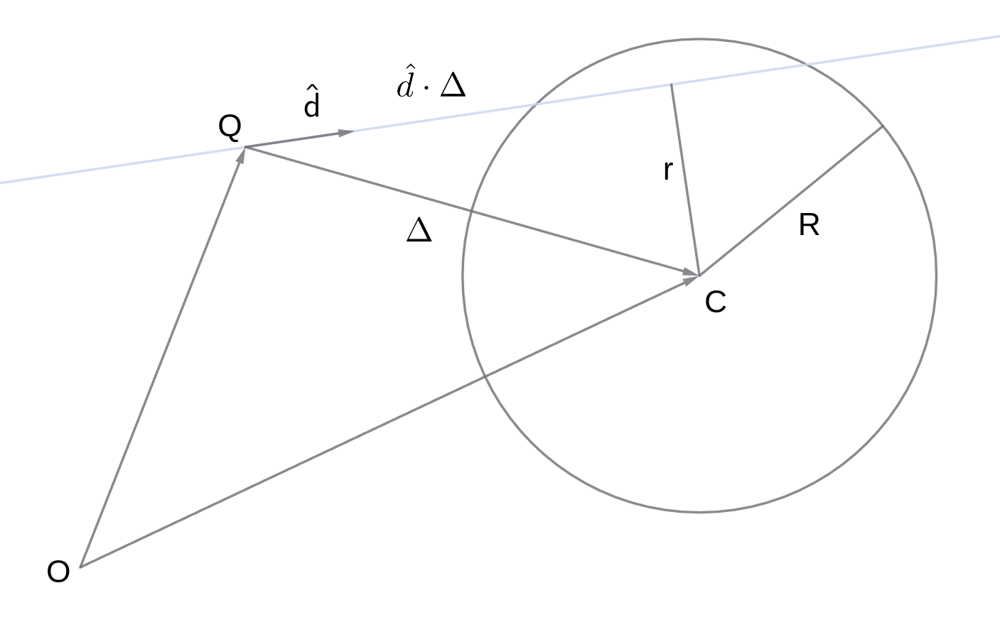

# Raytracing in one weekend in Uiua

Implementing [Markdown in one
weekend](<https://raytracing.github.io/books/RayTracingInOneWeekend.html>) in
Uiua.  Will see how hard this is, and how fast it goes.

## Sending a ray into the scene

Constants to scale and offset the initial set of points.
```uiua
Sf ← × 1_¯1_0 [∩÷ ImageWidth ViewPortWidth ImageHeight ViewPortHeight 0]
Os ← × 0.5 [¯ViewPortWidth ViewPortHeight × 2 ¯FocalLength]
```

We can calculate an initial picture in two ways, one which follows interative
approach of the ray tracing reference above, and one which is more `apl`ish,
doing the operations in parallel.  These are, the one potato two potato
iterative code:

```uiua
ProcessOnePixel ← (
  - Camera +Os ×Sf +[0.5 0.5 0] ⇌
  ÷⊸⍜°√/+
  [White [0.5 0.7 1]] [¯⊸-1] ÷2+1 ⊡₁
  /+×
)
OnePotato ← ∵₁ProcessOnePixel PixelGrid
```

The parallel version is:

```uiua
ProcessManyPixels ← (
  -Camera +Os ×Sf +[0.5 0.5 0] ⇌
  ÷¤ ⊸⍜°√/+
  [White [0.5 0.7 1]] [¯⊸-1]÷2+1⊡₁
  ≡(/+×) ¤ ⊙⍉
  ↯ [ImageHeight ImageWidth 3]
)
Parallel ← ProcessManyPixels ⍉ ♭₂ PixelGrid
```

Two interesting things are how simular the two version are.  The second is
speed, where the parallel version is 6 times faster on my desktop machine, and
10 times faster on the web site.  I had thought that the time difference was
even higher, a factor of 200, but maybe that was due to an earlier mistake.

## Intersection with a sphere

If a ray orignates from a point $\mathbf{Q}$, in direction $\mathbf{\hat{d}}$,
points on its path follow the formula $\mathbf{P} = \lambda \mathbf{\hat{d}} +
\mathbf{Q}$.

A sphere consists of points with a given distance $R$ from a center
$\mathbf{C}$, $(\mathbf{P} - \mathbf{C})^2 = R^2$.  Subsituting and solving for
$\lambda$, we get:

```math
\begin{eqnarray}
R^2 &=& (\mathbf{P} - \mathbf{C})^2 \\
R^2 &=& (\lambda \mathbf{\hat{d}} + \mathbf{Q} - \mathbf{C})^2
\end{eqnarray}
```

Define:

```math
\mathbf{\Delta} = \mathbf{C} - \mathbf{Q}
```

Then

```math
\begin{eqnarray}
(\lambda \mathbf{\hat{d}} + \mathbf{Q} - \mathbf{C})^2 &=& R^2 \\
(\lambda \mathbf{\hat{d}} - \mathbf{\Delta})^2 &=& R^2\\
(\lambda \mathbf{\hat{d}} - \mathbf{\Delta}) \cdot (\lambda \mathbf{\hat{d}} - \mathbf{\Delta}) &=& R^2\\
\mathbf{\hat{d}} \cdot \mathbf{\hat{d}} \lambda^2 - 2 \mathbf{\Delta} \cdot \mathbf{\hat{d}} \lambda + \mathbf{\Delta}^2 &=& R^2\\
\lambda^2 - 2 \mathbf{\Delta} \cdot \mathbf{\hat{d}} \lambda
+ \mathbf{\Delta}^2 - R^2 &=& 0
\end{eqnarray}
```

So

```math
\lambda = \mathbf{\Delta} \cdot \mathbf{\hat{d}} \pm \sqrt{ (\mathbf{\Delta}
\cdot \mathbf{\hat{d}})^2 - \mathbf{\Delta}^2 + R^2 }
```

### Geometic interpretation

We can derive this same formula from a geometic interpretation. The below
diagram is in the plane of $\mathbf{Q}$ and $\mathbf{C}$, so the sphere appears
as a circle with radius $R^2$.

Now, the closest the ray is to $\mathbf{C}$ is $r$, and, since $\mathbf{\hat{d}}
\cdot \mathbf{\Delta}$ is the distance from $\mathbf{Q}$ to this point, we have
$\Delta^2 = (\mathbf{\hat{d}} \cdot \mathbf{\Delta})^2 + r^2$.  So for the ray
to intersect the sphere we need:

```math
r^2 = \Delta^2  - (\mathbf{\hat{d}} \cdot \mathbf{\Delta})^2\\
R^2 - r^2 \ge 0\\
R^2 - \Delta^2  + (\mathbf{\hat{d}} \cdot \mathbf{\Delta})^2\ge 0
```

Which is the determitive of the above quadratic equation.



The distance between $r$ and the point of interection, $\delta$, satisfies $R^2
= r^2+ \delta^2$, hence $\delta = \pm \sqrt{R^2 - r^2}$, and the distance
between $\mathbf{Q}$ and the points of intersection is:

```math
\lambda = \mathbf{\hat{d}} \cdot \mathbf{\Delta} \pm \delta\\
\lambda = \mathbf{\hat{d}} \cdot \mathbf{\Delta} \pm \sqrt{R^2 - r^2}\\
\lambda = \mathbf{\hat{d}} \cdot \mathbf{\Delta} \pm \sqrt{R^2 - \Delta^2  + (\mathbf{\hat{d}} \cdot \mathbf{\Delta})^2}\\
```

The equation from above, but with a geometic understanding of the terms.
